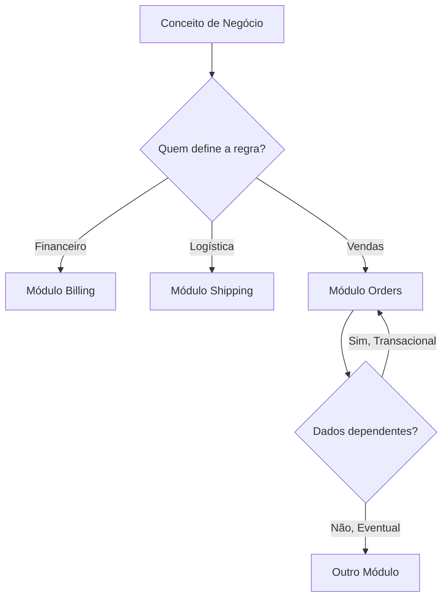

# Identificando Fronteiras de Módulos (Bounded Contexts)

Este guia complementa o [Guia de Comunicação Cross-Module](./modular-monolith-comunication.md), focando na pergunta essencial: **"Como saber onde um módulo termina e outro começa?"**

Não existe uma fórmula mágica, mas existem **4 Critérios Fundamentais** para identificar limites saudáveis em um Monólito Modular.

---

## 🏗️ 1. O Teste do Sinônimo (Linguagem Ubíqua)

O critério mais forte. Se uma mesma palavra tem significados, atributos ou comportamentos diferentes dependendo de *quem* está falando, você encontrou uma fronteira.

### Exemplo: A Entidade "Livro"
Num sistema de e-mail de uma editora:

- **Para o Time Editorial:** Um "Livro" é o conteúdo. Tem capítulos, revisores, rascunhos, ISBN.
- **Para o Time de Vendas:** Um "Livro" é um produto. Tem preço, estoque, peso para frete.
- **Para o Time Jurídico:** Um "Livro" é um contrato. Tem royalties, direitos autorais, validade.

### ❌ Errado (Modelo Único Gigante):
Criar uma classe `Book` com 50 campos misturando tudo (ISBN, Price, RoyaltyRate, DraftContent...).

### ✅ Certo (Módulos Separados):
Cada módulo tem seu próprio conceito, mesmo que usem o mesmo ID.

- **Módulo `Editorial`**: Classe `Manuscript` (foca no conteúdo).
- **Módulo `Sales`**: Classe `Product` (foca no preço/estoque).
- **Módulo `Legal`**: Classe `CopyrightContract` (foca nos direitos).

> **Dica:** Se você precisa usar prefixos para explicar um campo (`sales_price`, `printing_cost`), provavelmente está misturando contextos.

---

## 🔄 2. O Teste da Transação (Mudam Juntos?)

Dados que precisam estar **consistentemente atualizados no mesmo milissegundo** geralmente pertencem ao mesmo módulo. Dados que podem ter consistência eventual (segundos de atraso) podem ser separados.

### Pergunta Chave:
*"Se eu deletar A e o sistema falhar antes de deletar B, isso causa um prejuízo financeiro/legal imediato?"*

- **Sim (Invariante Crítica):** Devem estar no mesmo módulo, na mesma transação de banco.
  - *Ex:* Pedido e Item do Pedido. Não faz sentido um Item de Pedido orfão.
- **Não (Consistência Eventual):** Podem estar em módulos separados.
  - *Ex:* Pedido e Histórico de Recomendações. Se eu criar um pedido e a recomendação só atualizar 5 segundos depois, ninguém morre.

---

## 🏢 3. O Teste do Organograma (Business Capability)

A Lei de Conway diz que o software reflete a estrutura de comunicação da empresa. Use isso a seu favor.

- Quem é o "Dono" dessa funcionalidade?
- Quem define as regras?

Se o Departamento Financeiro define as regras de **Faturamento** e o Departamento de Logística define as regras de **Frete**, misturar tudo num módulo `Checkout` é pedir problema. Quando a Logística mudar a regra de CEP, você corre o risco de quebrar o Faturamento.

### Separação por Capability:
- Módulo `Billing` (Respondendo ao CFO)
- Módulo `Shipping` (Respondendo ao COO)
- Módulo `Catalog` (Respondendo ao Marketing)

O `Checkout` vira apenas um orquestrador que chama esses módulos especializados.

---

## ⏳ 4. O Teste do Ciclo de Vida (Lifecycle)

Analise a frequência de mudança e a criticidade de cada parte.

- **Módulo A (Core):** Muda pouco, extremamente crítico, alta estabilidade. (Ex: Ledgers Contábeis).
- **Módulo B (Inovação):** Muda todo dia, muitos testes A/B, pode falhar às vezes. (Ex: Recomendações de vitrine, Newsletters).

Se você coloca os dois juntos, a instabilidade do B vai derrubar o A. E a burocracia de deploy do A vai travar a inovação do B. **Separe-os.**

---

## 🚨 Cheiro de Módulo Ruim (God Module)

Como saber se você errou na mão e criou um "God Module" (Monólito dentro do Monólito)?

1.  **Muitas Tabelas:** O módulo tem 50 tabelas no schema dele.
2.  **Testes Lentos:** A suite de testes do módulo demora 10 minutos.
3.  **Deploy Medroso:** "Melhor não fazer deploy desse módulo na sexta-feira".
4.  **Dependências Circulares:** O módulo A precisa do B, que precisa do A (sinal de que eles deveriam ser um só ou serem quebrados em 3).
5.  **Nomes Genéricos:** Módulos com nomes como `Common`, `Core`, `Manager` ou `System`. Um módulo deve ter nome funcional (`Sales`, `Inventory`).

---

## 🗺️ Resumo Visual

